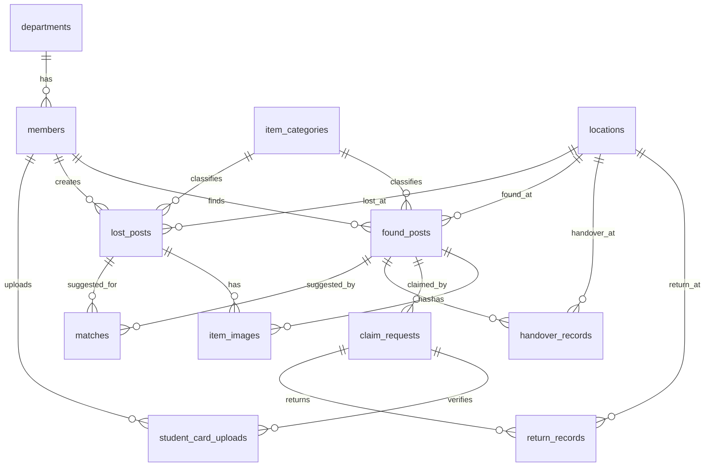
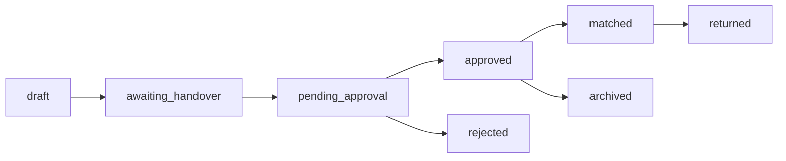

# Database Design: Lost & Found Hub

เอกสารนี้เป็นแบบฐานข้อมูลเวอร์ชันกระชับสำหรับระบบแจ้งของหายและพบสิ่งของในมหาวิทยาลัย โดยตัดตารางที่ยังไม่จำเป็นออก เพื่อให้ทำงานทันและนำไปใช้กับ XAMPP/phpMyAdmin ได้ง่ายขึ้น

## แนวคิดหลัก

- ใช้ MySQL/MariaDB สำหรับ XAMPP เป็น schema หลัก
- เก็บเฉพาะข้อมูลที่จำเป็นต่อ flow: สมัครสมาชิก, เข้าสู่ระบบ, แจ้งของหาย, แจ้งพบของ, ส่งของเข้าห้องคุ้มครอง, อนุมัติ, จับคู่รายการ, ขอรับคืน และคืนของ
- ใช้ `found_posts.status` เก็บสถานะการตรวจสอบ/อนุมัติ แทนการแยกตารางประวัติอนุมัติ
- ใช้ Weighted Score Matching ในฝั่ง Node.js แล้วบันทึกผลลง `matches` เมื่อคะแนนผ่านเกณฑ์
- แยก `handover_records` ออกจาก `return_records` เพราะเป็นคนละเหตุการณ์

## ตารางที่ใช้จริง

| กลุ่มข้อมูล | ตาราง |
| --- | --- |
| สมาชิก | `members`, `student_card_uploads` |
| ข้อมูลพื้นฐาน | `departments`, `item_categories`, `locations` |
| ประกาศของหาย | `lost_posts`, `item_images` |
| ประกาศของที่พบเจอ | `found_posts`, `item_images`, `handover_records` |
| ขอรับคืน/คืนของ | `claim_requests`, `return_records` |
| ระบบแนะนำรายการที่อาจตรงกัน | `matches` |
| แจ้งเตือนในแอป | `notifications` |

## ตารางที่ตัดออก

| ตาราง | เหตุผล |
| --- | --- |
| `approval_logs` | ยังไม่จำเป็น เพราะสถานะล่าสุดเก็บใน `found_posts.status`, `approved_by`, `approved_at`, `reject_reason` ได้แล้ว |
| `audit_logs` | เป็นประวัติการแก้ไขเชิงระบบ เหมาะกับเวอร์ชันใหญ่กว่า แต่ไม่จำเป็นต่อ flow หลักตอนนี้ |
| `claim_requests.returned_at` | ซ้ำกับ `return_records.returned_at` จึงตัดออก |

## ตารางหลัก

### `members`

เก็บผู้ใช้งานทั้งหมด ทั้งนักศึกษา อาจารย์ และผู้ดูแลระบบ ใช้กับ Register, Login, Logout และ Profile

คอลัมน์สำคัญ: `id`, `role`, `username`, `password_hash`, `student_code`, `employee_code`, `first_name`, `last_name`, `email`, `phone`, `department_id`, `identity_status`, `card_image_url`, `avatar_url`, `is_active`, `last_login_at`

### `student_card_uploads`

เก็บรูปบัตรนักศึกษา/หลักฐานยืนยันตัวตน และเชื่อมกับ `claim_request_id` ได้เมื่ออัปโหลดเพื่อขอรับของคืนรายการใดรายการหนึ่ง

คอลัมน์สำคัญ: `member_id`, `claim_request_id`, `image_url`, `status`, `reviewed_by`, `reviewed_at`, `reject_reason`

### `departments`

เก็บข้อมูลภาควิชา ใช้กับสมาชิกและรายงาน

คอลัมน์สำคัญ: `code`, `name_th`, `name_en`, `is_active`

### `item_categories`

เก็บประเภทสิ่งของ เช่น อิเล็กทรอนิกส์ กระเป๋า/เอกสาร กุญแจ/บัตร ขวดน้ำ อื่น ๆ

คอลัมน์สำคัญ: `name_th`, `description`, `is_active`

### `locations`

เก็บสถานที่ที่พบ/สูญหาย/ส่งมอบ เช่น ห้องคุ้มครอง อาคารเรียน โรงอาหาร ห้องสมุด

คอลัมน์สำคัญ: `name_th`, `building`, `floor`, `detail`, `location_type`, `is_active`

### `lost_posts`

เก็บประกาศของหายที่เจ้าของสร้าง

คอลัมน์สำคัญ: `owner_id`, `category_id`, `lost_location_id`, `title`, `description`, `color`, `brand`, `unique_mark`, `lost_at`, `contact_name`, `contact_channel`, `status`

### `found_posts`

เก็บประกาศพบสิ่งของที่ผู้พบสร้าง แล้วรอส่งของและรออาจารย์อนุมัติ

คอลัมน์สำคัญ: `finder_id`, `category_id`, `found_location_id`, `title`, `description`, `color`, `brand`, `unique_mark`, `found_at`, `status`, `approved_by`, `approved_at`, `reject_reason`

### `item_images`

เก็บรูปภาพของประกาศของหายหรือของที่พบเจอ โดย 1 รูปต้องผูกกับ `lost_post_id` หรือ `found_post_id` อย่างใดอย่างหนึ่งเท่านั้น

### `handover_records`

เก็บหลักฐานตอนผู้พบของนำของไปส่งที่ห้องคุ้มครอง

คอลัมน์สำคัญ: `found_post_id`, `received_by`, `handover_location_id`, `handed_over_at`, `proof_image_url`, `note`

### `matches`

เก็บผล Weighted Score Matching ว่าประกาศของหายรายการใดอาจตรงกับประกาศพบของรายการใด

คอลัมน์สำคัญ: `lost_post_id`, `found_post_id`, `match_score`, `status`

สถานะที่ใช้: `suggested`, `confirmed`, `rejected`

### `claim_requests`

เก็บคำขอรับของคืนจากเจ้าของ

คอลัมน์สำคัญ: `found_post_id`, `claimant_id`, `lost_post_id`, `claim_message`, `status`, `verified_by`, `verified_at`, `reject_reason`

### `return_records`

เก็บรายละเอียดการคืนของจริงจากอาจารย์/เจ้าหน้าที่ให้เจ้าของ

คอลัมน์สำคัญ: `claim_request_id`, `found_post_id`, `returned_by`, `received_by`, `return_location_id`, `proof_image_url`, `note`, `returned_at`

## Weighted Score Matching

ระบบฝั่ง Node.js ควร query candidate ก่อน ไม่ควรเทียบทุก record ในฐานข้อมูล เช่น คัดเฉพาะประเภทเดียวกัน วันที่ใกล้กัน หรือสถานที่ใกล้กัน จากนั้นค่อยคำนวณคะแนน

| เงื่อนไข | คะแนน |
| --- | ---: |
| ประเภทสิ่งของตรงกัน | 40 |
| สถานที่ตรงกัน | 25 |
| วันที่ใกล้กันไม่เกิน 3 วัน | 20 |
| สี/รายละเอียดใกล้เคียงกัน | 15 |

ถ้าคะแนนรวมตั้งแต่ 70 ขึ้นไป ให้บันทึกลง `matches` ด้วยสถานะ `suggested` และแสดงข้อความว่า “พบรายการที่อาจตรงกัน”

## ERD

ดูภาพรวมแบบตารางได้ที่ [lost-found-database-overview.png](./lost-found-database-overview.png)

ดูภาพแบบ Chen notation ได้ที่ [lost-found-chen-erd.svg](./lost-found-chen-erd.svg)

## Workflow สถานะของประกาศพบสิ่งของ

## Mapping Process

| Process | ตารางที่เกี่ยวข้อง |
| --- | --- |
| 1.1 จัดการข้อมูลสมาชิก | `members` |
| 1.2 จัดการข้อมูลประเภทสิ่งของ | `item_categories` |
| 1.3 จัดการข้อมูลภาควิชา | `departments` |
| 1.4 จัดการข้อมูลสถานที่ | `locations` |
| 2.1 ลงทะเบียนผู้ใช้งานใหม่ | `members` |
| 2.2 เข้าสู่ระบบ | `members.username`, `members.password_hash`, `members.last_login_at` |
| 2.3 จัดการ Profile | `members` |
| 2.4 อัปโหลดรูปบัตรนักศึกษา | `student_card_uploads` |
| 3.1-3.4 ประกาศของหาย | `lost_posts`, `item_images`, `matches` |
| 4.1-4.4 ประกาศพบสิ่งของ | `found_posts`, `item_images`, `handover_records`, `claim_requests`, `matches` |
| 5.1-5.5 ตรวจสอบและอนุมัติ | `found_posts`, `handover_records`, `claim_requests`, `return_records` |
| 6. ค้นหา | indexes บน `lost_posts`, `found_posts`, `item_categories`, `locations`, `matches` |
| 7. แจ้งเตือน | ใช้ UI notification/toast ในเว็บก่อน ยังไม่ต้องมีตาราง |
| 8. รายงาน | report views ใน `database/lost_found_hub_xampp_mysql.sql` |

## รายงานที่รองรับ

| รายงาน | แหล่งข้อมูล |
| --- | --- |
| จำนวนรายการสิ่งของสูญหาย | `lost_posts` |
| จำนวนรายการสิ่งของที่พบเห็น | `found_posts` |
| สถานะการคืนสิ่งของ | `found_posts.status`, `claim_requests.status`, `return_records` |
| จำนวนรายการค้าง | `found_posts.status in ('awaiting_handover', 'pending_approval', 'approved', 'matched')` |
| ประเภทของสิ่งของสูญหาย | `lost_posts` + `item_categories` |
| ข้อมูลผู้ใช้งาน | `members` + `departments` |
| รายงานตามวัน เดือน ปี | `created_at`, `lost_at`, `found_at`, `return_records.returned_at` |

## ไฟล์สำหรับใช้งาน

- ไฟล์ import XAMPP: `database/lost_found_hub_xampp_mysql.sql`
- ไฟล์ ZIP สำหรับดาวน์โหลด: `database/lost_found_hub_xampp_mysql.zip`
- ตัวอย่าง Matching API: `backend/src/examples/matching-api-example.js`
- Logic Matching: `backend/src/services/weightedScoreMatching.js`
