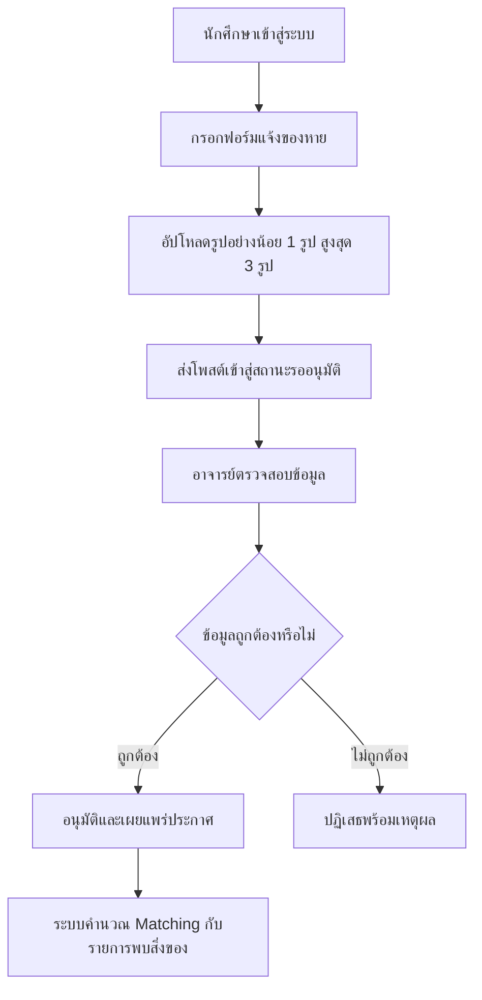
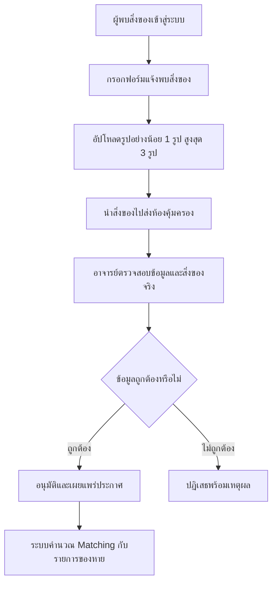
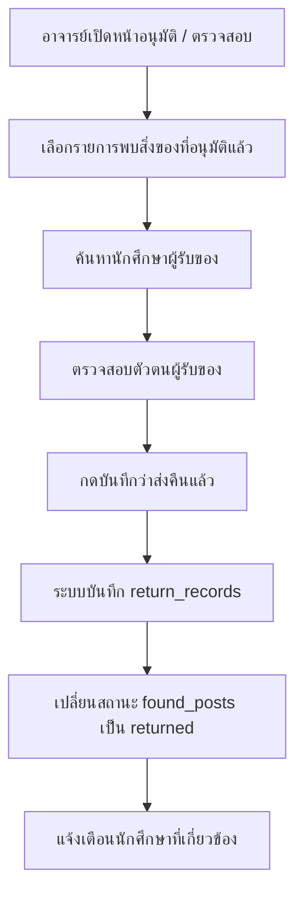

# Lost and Found Hub - Project Web Summary

เอกสารนี้สรุปภาพรวมของโปรเจกต์เว็บ Lost and Found Hub สำหรับระบบประกาศสิ่งของสูญหายและสิ่งของที่พบเจอ ภายในคณะวิทยาศาสตร์ธรรมชาติ มหาวิทยาลัยในประเทศลาว

## 1. วัตถุประสงค์ของระบบ

ระบบนี้ถูกออกแบบมาเพื่อช่วยจัดการสิ่งของสูญหายและสิ่งของที่พบเจอในคณะ โดยให้ผู้ใช้งานสามารถแจ้งประกาศผ่านเว็บไซต์ และให้อาจารย์หรือเจ้าหน้าที่ห้องคุ้มครองเป็นผู้ตรวจสอบ อนุมัติ และติดตามสถานะการคืนสิ่งของ

เป้าหมายหลักของระบบ:

- ลดการประกาศซ้ำหรือข้อมูลกระจัดกระจาย
- ให้ผู้พบสิ่งของแจ้งข้อมูลพร้อมรูปภาพได้
- ให้ผู้ทำของหายแจ้งข้อมูลสิ่งของที่สูญหายได้
- ให้อาจารย์ตรวจสอบก่อนเผยแพร่ประกาศ
- แนะนำรายการที่อาจตรงกันด้วยระบบ Weighted Score Matching
- บันทึกประวัติการคืนสิ่งของให้เจ้าของ

## 2. กลุ่มผู้ใช้งาน

### 2.1 ผู้เยี่ยมชม

ผู้ที่ยังไม่ได้เข้าสู่ระบบ สามารถดูหน้าแรก คู่มือการใช้งานแบบสั้น และรายการประกาศที่ได้รับการอนุมัติแล้วได้

### 2.2 นักศึกษา

นักศึกษาสามารถสมัครสมาชิกเองได้ โดยไม่ต้องรอให้อาจารย์อนุมัติบัญชี หลังจากเข้าสู่ระบบแล้วสามารถใช้งานฟังก์ชันหลักได้ เช่น

- แจ้งของหาย
- แจ้งพบสิ่งของ
- อัปโหลดรูปภาพประกอบประกาศ
- แก้ไขหรือลบโพสต์ที่ยังไม่ถูกอนุมัติ
- ดูสถานะประกาศของตัวเอง
- รับแจ้งเตือนเมื่อโพสต์ถูกอนุมัติหรือปฏิเสธ
- รับแจ้งเตือนเมื่อมีรายการที่อาจตรงกัน
- แก้ไขข้อมูลโปรไฟล์และรูปโปรไฟล์

### 2.3 อาจารย์ / เจ้าหน้าที่ห้องคุ้มครอง

อาจารย์และ Admin ถือเป็นบทบาทเดียวกันในระบบนี้ โดยบัญชีอาจารย์ไม่เปิดให้สมัครผ่านหน้าเว็บไซต์ ต้องสร้างหรือจัดการจากระบบภายในเท่านั้น

หน้าที่ของอาจารย์:

- ตรวจสอบและอนุมัติโพสต์แจ้งของหาย
- ตรวจสอบและอนุมัติโพสต์แจ้งพบสิ่งของ
- ปฏิเสธโพสต์ที่ข้อมูลไม่ถูกต้อง
- เปลี่ยนสถานะสิ่งของที่พบเป็นส่งคืนแล้ว
- เลือกนักศึกษาผู้รับของคืนด้วยช่องค้นหา
- จัดการข้อมูลพื้นฐาน เช่น ประเภทสิ่งของ สถานที่ ภาควิชา และผู้ใช้
- ปิดการใช้งานหรือลบผู้ใช้ที่ไม่เหมาะสม
- ดูรายงานสรุปของระบบ

## 3. ภาษาที่ใช้ในระบบ

แนวทางภาษาของโปรเจกต์:

- UI หน้าเว็บไซต์ใช้ภาษาลาว
- โค้ดใช้ภาษาอังกฤษ
- ชื่อตารางและคอลัมน์ฐานข้อมูลใช้ภาษาอังกฤษ
- ข้อมูลสถานที่ใช้ข้อมูลจริงของคณะวิทยาศาสตร์ธรรมชาติ
- Font หลักใช้ Noto Sans Lao เพื่อให้อ่านภาษาลาวได้ชัดเจน

## 4. หน้าเว็บหลัก

| หน้า | ผู้ใช้ที่เข้าถึง | หน้าที่ของหน้า |
| --- | --- | --- |
| Home | ทุกคน | หน้าแรก แสดงคู่มือสั้น รายการประกาศล่าสุด และช่องค้นหา |
| Login / Register | Guest | เข้าสู่ระบบ และสมัครสมาชิกเฉพาะนักศึกษา |
| Dashboard | นักศึกษา / อาจารย์ | สรุปข้อมูลตามบทบาท และคู่มือหลังเข้าสู่ระบบ |
| Report Lost | นักศึกษา / อาจารย์ | แจ้งสิ่งของสูญหาย |
| Report Found | นักศึกษา / อาจารย์ | แจ้งพบสิ่งของ |
| Announcement Detail | ทุกคนตามสิทธิ์ | ดูรายละเอียดประกาศแบบลงลึก |
| Notifications | นักศึกษา / อาจารย์ | ดูแจ้งเตือนในระบบ |
| Approval | อาจารย์ | อนุมัติ ปฏิเสธ และติดตามสถานะสิ่งของ |
| Matching | อาจารย์ | ดูรายการที่ระบบแนะนำว่าอาจตรงกัน |
| Master Data | อาจารย์ | จัดการข้อมูลพื้นฐานและข้อมูลผู้ใช้ |
| Reports | นักศึกษา / อาจารย์ | ดูรายงานตามสิทธิ์ |
| Profile | นักศึกษา / อาจารย์ | จัดการข้อมูลส่วนตัวและรูปโปรไฟล์ |

## 5. Workflow หลักของระบบ

### 5.1 การแจ้งของหาย



### 5.2 การแจ้งพบสิ่งของ



### 5.3 การส่งคืนสิ่งของ



## 6. กฎสำคัญของระบบ

- นักศึกษาสมัครสมาชิกได้เอง
- อาจารย์ไม่สามารถสมัครผ่านหน้าเว็บได้
- อาจารย์ไม่แก้ไขข้อมูลนักศึกษาโดยตรง แต่สามารถปิดการใช้งานหรือลบได้
- การอนุมัติมีเฉพาะโพสต์ประกาศ ไม่ใช่บัญชีนักศึกษา
- โพสต์ที่ยังไม่อนุมัติสามารถแก้ไขหรือลบได้
- โพสต์ที่อาจารย์อนุมัติแล้วไม่ควรให้ผู้ใช้แก้ไขเอง
- การแจ้งของหายและแจ้งพบสิ่งของต้องมีรูปอย่างน้อย 1 รูป
- รูปภาพต่อโพสต์สูงสุด 3 รูป
- รูปภาพต้องอัปโหลดเป็นไฟล์ ไม่ใช้การกรอก URL เอง
- สิ่งของที่พบต้องส่งคืนเจ้าของผ่านอาจารย์หรือเจ้าหน้าที่ห้องคุ้มครอง
- สถานที่ส่งมอบสิ่งของจริงมีเพียงห้องคุ้มครองเท่านั้น

## 7. ระบบ Matching

ระบบ Matching ใช้สำหรับแนะนำรายการที่อาจตรงกันระหว่างของหายและของที่พบ ไม่ใช่การยืนยันว่าเป็นสิ่งของเดียวกันแน่นอน

แนวคิด Weighted Score Matching:

| เงื่อนไข | คะแนน |
| --- | ---: |
| ประเภทสิ่งของตรงกัน | 40 |
| สถานที่ใกล้เคียงหรือตรงกัน | 25 |
| วันที่ใกล้กัน | 20 |
| สี ยี่ห้อ หรือรายละเอียดใกล้เคียง | 15 |

ถ้าคะแนนรวมตั้งแต่ 70% ขึ้นไป ระบบจะแสดงว่าเป็นรายการที่อาจตรงกัน และบันทึกผลไว้ในตาราง `matches`

สถานะของ `matches` ควรใช้เพื่อบอกผลการแนะนำเท่านั้น เช่น `suggested` ไม่ควรใช้เป็นขั้นตอนรออนุมัติ

## 8. ฐานข้อมูลหลัก

ตารางสำคัญในระบบ:

| ตาราง | หน้าที่ |
| --- | --- |
| `members` | เก็บข้อมูลผู้ใช้ นักศึกษา และอาจารย์ |
| `departments` | เก็บข้อมูลภาควิชา |
| `item_categories` | เก็บประเภทสิ่งของ |
| `locations` | เก็บสถานที่ภายในคณะ |
| `lost_posts` | เก็บประกาศของหาย |
| `found_posts` | เก็บประกาศพบสิ่งของ |
| `item_images` | เก็บรูปภาพประกอบประกาศ |
| `matches` | เก็บผลการจับคู่รายการที่อาจตรงกัน |
| `claim_requests` | เก็บคำขอรับคืนของ |
| `return_records` | เก็บประวัติการคืนสิ่งของจริง |
| `student_card_uploads` | เก็บรูปบัตรนักศึกษาหรือหลักฐานยืนยันตัวตน |

ไฟล์ SQL สำหรับนำเข้าใน XAMPP/phpMyAdmin อยู่ในโฟลเดอร์ `database/`

ไฟล์หลักที่ควรใช้:

- `database/schema_mysql.sql`
- `database/lost_found_hub_xampp_mysql.sql`
- `database/fns_master_data_seed.sql`

## 9. โครงสร้างโปรเจกต์

```text
New project/
├─ frontend/                 # React + Vite frontend
│  ├─ src/
│  │  ├─ api/                # ฟังก์ชันเรียก Backend API
│  │  ├─ assets/             # รูปภาพและไฟล์ประกอบ UI
│  │  ├─ components/         # Component ที่ใช้ซ้ำ
│  │  ├─ hooks/              # React hooks
│  │  ├─ pages/              # หน้าเว็บแต่ละหน้า
│  │  ├─ utils/              # helper ฝั่ง frontend
│  │  ├─ App.jsx
│  │  └─ main.jsx
│  └─ vite.config.js
│
├─ backend/                  # Express backend
│  └─ src/
│     ├─ config/             # Database connection
│     ├─ routes/             # API routes
│     ├─ services/           # Business logic
│     ├─ utils/              # helper ฝั่ง backend
│     └─ index.js            # จุดเริ่มต้น API server
│
├─ database/                 # SQL schema และ seed data
├─ docs/                     # เอกสารประกอบโปรเจกต์
├─ uploads/                  # ไฟล์รูปภาพที่อัปโหลด
├─ scripts/                  # Script ช่วยรันระบบ
├─ package.json
└─ .env.example
```

## 10. Technology Stack

| ส่วน | เทคโนโลยี |
| --- | --- |
| Frontend | React, Vite, CSS, Lucide React |
| Backend | Node.js, Express |
| Database | MySQL / MariaDB ผ่าน XAMPP |
| Upload | Multer |
| Email | Nodemailer, Gmail SMTP |
| Font | Noto Sans Lao |

## 11. วิธีรันโปรเจกต์

ติดตั้ง package:

```bash
npm install
```

สร้างไฟล์ `.env` จาก `.env.example` แล้วตั้งค่า database และ SMTP ตามเครื่องที่ใช้งาน

รัน Frontend:

```bash
npm run dev
```

รัน Backend:

```bash
npm run server
```

รันทั้ง Frontend และ Backend พร้อมกัน:

```bash
npm run dev:full
```

Build สำหรับตรวจสอบก่อนส่งงาน:

```bash
npm run build
```

URL ที่ใช้ตอนพัฒนา:

- Frontend: `http://127.0.0.1:5173/`
- Backend health check: `http://127.0.0.1:3002/api/health`

## 12. API หลัก

ตัวอย่าง API ที่ใช้งานในระบบ:

| API | หน้าที่ |
| --- | --- |
| `POST /api/auth/login` | เข้าสู่ระบบ |
| `POST /api/auth/register` | สมัครสมาชิกนักศึกษา |
| `POST /api/auth/password-reset/request` | ขอ OTP สำหรับลืมรหัสผ่าน |
| `POST /api/auth/password-reset/verify` | ตรวจสอบ OTP |
| `POST /api/auth/password-reset/confirm` | ตั้งรหัสผ่านใหม่ |
| `GET /api/master-data` | โหลดข้อมูลพื้นฐาน |
| `POST /api/uploads/images` | อัปโหลดรูปภาพ |
| `GET /api/lost-posts` | ดึงรายการของหาย |
| `POST /api/lost-posts` | สร้างโพสต์ของหาย |
| `PUT /api/lost-posts/:id` | แก้ไขโพสต์ของหาย |
| `POST /api/lost-posts/:id/approve` | อนุมัติโพสต์ของหาย |
| `POST /api/lost-posts/:id/reject` | ปฏิเสธโพสต์ของหาย |
| `GET /api/found-posts` | ดึงรายการพบสิ่งของ |
| `POST /api/found-posts` | สร้างโพสต์พบสิ่งของ |
| `PUT /api/found-posts/:id` | แก้ไขโพสต์พบสิ่งของ |
| `POST /api/found-posts/:id/approve` | อนุมัติโพสต์พบสิ่งของ |
| `POST /api/found-posts/:id/reject` | ปฏิเสธโพสต์พบสิ่งของ |
| `POST /api/found-posts/:id/return` | บันทึกการส่งคืนสิ่งของ |
| `GET /api/matches` | ดึงรายการ Matching |
| `GET /api/return-records` | ดึงประวัติการคืนสิ่งของ |

## 13. การแจ้งเตือน

ระบบแจ้งเตือนแบ่งเป็น 2 ส่วน:

- แจ้งเตือนในหน้าเว็บ
- แจ้งเตือนทาง Email

ตัวอย่างเหตุการณ์ที่ควรแจ้งเตือน:

- นักศึกษาส่งโพสต์ใหม่ให้อาจารย์ตรวจสอบ
- อาจารย์อนุมัติโพสต์
- อาจารย์ปฏิเสธโพสต์
- ระบบพบรายการที่อาจตรงกัน
- อาจารย์บันทึกว่าส่งคืนสิ่งของแล้ว

การส่ง Email ใช้ Gmail SMTP ผ่าน `nodemailer` และตั้งค่าจากไฟล์ `.env`

## 14. รายงาน

หน้ารายงานควรใช้ข้อมูลจากตารางจริงและ view สำหรับสรุปผล ไม่จำเป็นต้องมีตาราง report แยกเป็นข้อมูลหลัก เพราะรายงานเป็นข้อมูลที่คำนวณจากโพสต์ ผู้ใช้ สถานะ และประวัติการคืนสิ่งของ

ตัวอย่างรายงาน:

- จำนวนประกาศของหาย
- จำนวนประกาศพบสิ่งของ
- จำนวนสิ่งของที่คืนแล้ว
- จำนวนรายการค้างอยู่
- รายงานตามประเภทสิ่งของ
- รายงานตามวัน เดือน ปี
- รายงานผู้ใช้งานตามบทบาทและภาควิชา

## 15. ข้อจำกัดและสิ่งที่ควรพัฒนาต่อ

สิ่งที่ระบบปัจจุบันตั้งใจทำ:

- ใช้ในระดับคณะเดียว
- จำกัดบทบาทเป็นนักศึกษาและอาจารย์
- เน้น flow แจ้งของหาย แจ้งพบสิ่งของ อนุมัติ Matching และคืนของ
- ไม่เพิ่มระบบที่เกินความจำเป็น เช่น chat, rating, payment หรือ delivery

สิ่งที่สามารถพัฒนาต่อในอนาคต:

- เพิ่มการค้นหา Matching ที่แม่นขึ้น
- เพิ่มหน้ารายละเอียดประวัติการคืนของ
- เพิ่ม export รายงานเป็น PDF หรือ Excel
- เพิ่มระบบ log การแก้ไขข้อมูลสำหรับเวอร์ชันใช้งานจริง
- เพิ่มการยืนยันตัวตนกับระบบนักศึกษาของมหาวิทยาลัย หากมี API ภายนอกให้เชื่อมต่อ

